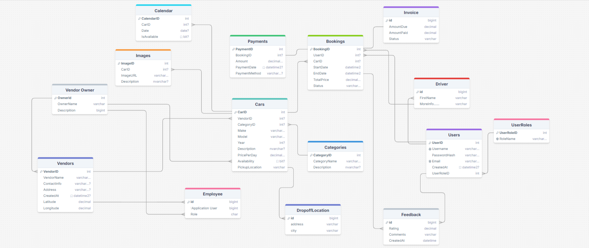

# Car Rental System
[APIs: http://getcar.runasp.net/swagger/index.html]
Overview
This application is a Car Rental System designed to provide a comprehensive solution for car rental services, allowing vendors, sub-vendors, and their employees to manage cars, bookings, and other related operations. The system is built using ASP.NET Core with Entity Framework Core for data management and JWT Authentication for secure access.

# Key Features:
Car Management: Vendors and sub-vendors can add, update, and manage their car listings.
Booking System: Customers can search for available cars, book them for specific dates, and manage their bookings.
File Upload: Upload important documents like ID, company logo, business license, etc., for verification using file uploads via multipart/form-data.
Authentication & Authorization: Uses JWT tokens to authenticate users and ensures role-based access to various features (Vendor, Sub-Vendor, Customer, Admin).
Vendor Hierarchy: A Vendor can have sub-vendors, and both can manage employees (IT, Finance, Manager).
Driver Management: Allows customers to add and manage drivers linked to their profile.
Application Flow
1. User Registration & Authentication
Vendor/Owner Registration: New vendors can register by providing details such as company name, manager, location, and uploading necessary documents (ID, business license, company logo, etc.). The files are handled using multipart/form-data to securely upload and save files.
JWT Authentication: Users authenticate themselves using JWT, which allows them to securely access protected endpoints after login.
2. Car Management
Add/Update Cars: Vendors and their sub-vendors can add or update cars. Each car has details such as make, model, year, price per day, and more. They can also assign pickup and drop-off locations.
File Upload: When adding cars, vendors can upload images of the car for listing.
3. Booking & Availability
Search Cars: Customers can search for available cars based on criteria like location, pickup date, and drop-off date. The search algorithm ensures that only cars available within the requested date range are shown.
Booking a Car: Once a car is selected, customers can proceed to book it for the specified dates. Availability is dynamically checked during booking.
4. File Upload Service
This system allows for secure file uploads of important documents like business licenses, insurance certificates, and identification cards.
Save File Service: A custom service handles file uploads both from Base64 strings and IFormFile. Files are stored securely in the server's wwwroot/uploads directory, and only relative paths are saved in the database for easy access.
5. Driver Management
Customers can add multiple drivers to their profile. These drivers can be used during car bookings.
Add Drivers: The system supports the creation and management of drivers associated with a customer. Each customer can have multiple drivers.
6. Authorization
Role-Based Access Control (RBAC): The system has multiple user roles: Admin, Vendor, Sub-Vendor, Customer, and various employee roles like IT, Finance, and Manager. Only authorized users can perform specific actions (e.g., only vendors can add or update cars).
Permission Checks: The application checks if a user has the necessary permissions to perform certain actions (e.g., a sub-vendor cannot edit the vendor's branch).

# Technology Stack
ASP.NET Core 8.0
Entity Framework Core: ORM for data access.
JWT Authentication: For secure access to APIs.
SQL Server: Relational database to store the system's data.
File Uploads: Managed using multipart/form-data and custom services.
